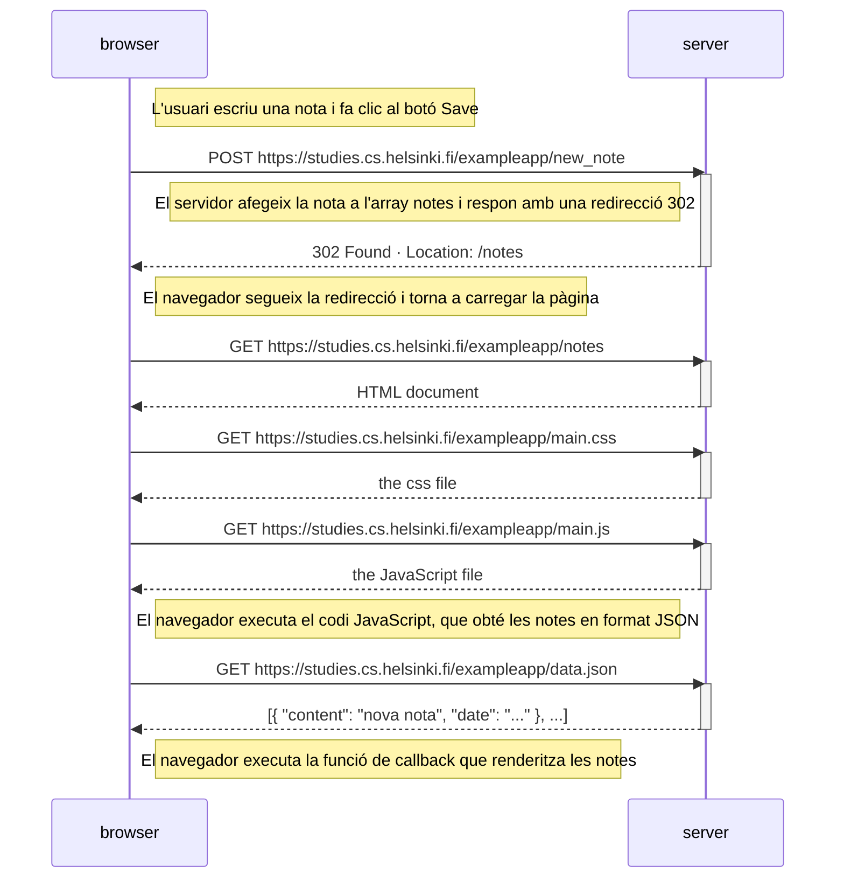

# 0.4 Nova nota (aplicació tradicional)

Diagrama de la cadena d'esdeveniments quan l'usuari crea una nova nota a `https://studies.cs.helsinki.fi/exampleapp/notes`, escrivint al camp de text i fent clic al botó `Save`.

