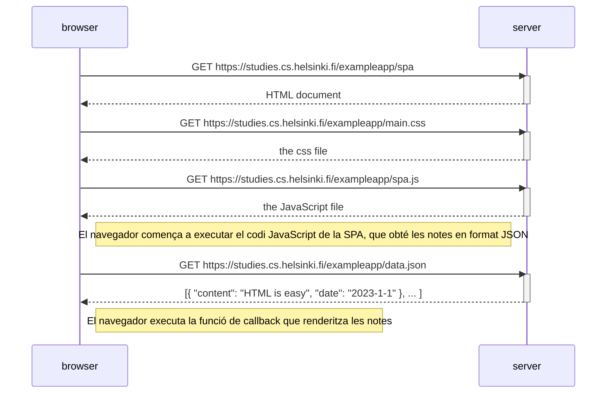

# 0.5 Diagrama de l'aplicació d'una sola pàgina

Situació en què l'usuari accedeix a la versió SPA de l'aplicació de notes a `https://studies.cs.helsinki.fi/exampleapp/spa`.

```mermaid
sequenceDiagram
    participant browser
    participant server

    browser->>server: GET https://studies.cs.helsinki.fi/exampleapp/spa
    activate server
    server-->>browser: HTML document
    deactivate server

    browser->>server: GET https://studies.cs.helsinki.fi/exampleapp/main.css
    activate server
    server-->>browser: the css file
    deactivate server

    browser->>server: GET https://studies.cs.helsinki.fi/exampleapp/spa.js
    activate server
    server-->>browser: the JavaScript file
    deactivate server

    Note right of browser: El navegador comença a executar el codi JavaScript de la SPA, que obté les notes en format JSON

    browser->>server: GET https://studies.cs.helsinki.fi/exampleapp/data.json
    activate server
    server-->>browser: [{ "content": "HTML is easy", "date": "2023-1-1" }, ... ]
    deactivate server

    Note right of browser: El navegador executa la funció de callback que renderitza les notes
```